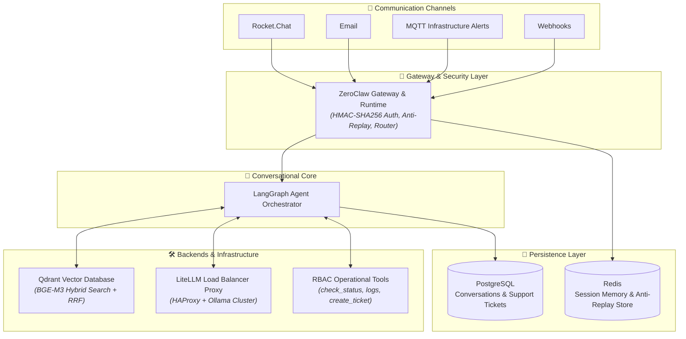
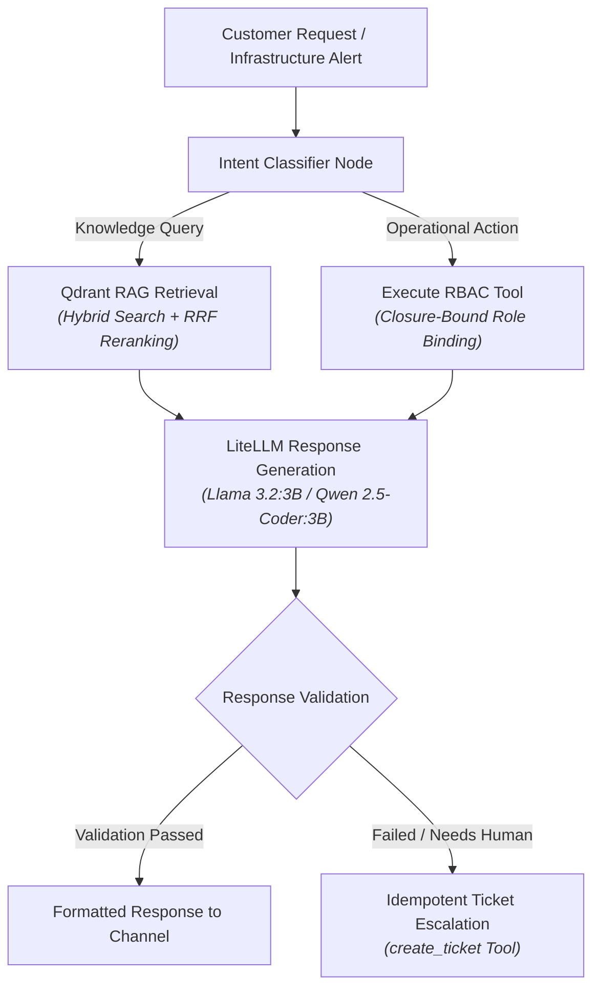

# FelCloud AI Support Agent

<div align="center">

[](https://www.python.org/)
[](https://www.langchain.com/langgraph)
[](https://qdrant.tech/)
[](https://ollama.ai/)
[](https://github.com/BerriAI/litellm)
[](https://fastapi.tiangolo.com/)
[](https://www.postgresql.org/)
[](https://redis.io/)
[](https://www.haproxy.org/)
[](tests/)
[](LICENSE)

**An enterprise-grade, self-hosted AI Technical Support Agent built for OpenStack & Cloud Infrastructure.**

</div>

---

## 📌 Overview

The **FelCloud AI Support Agent** is an autonomous, production-ready technical support automation platform designed to operate natively on local compute infrastructure without relying on external third-party LLM APIs. 

By integrating **ZeroClaw** (gateway runtime) with **LangGraph** (workflow orchestration), the system intelligently processes customer inquiries across multiple channels (Webhooks, Email, Rocket.Chat, and MQTT infrastructure alerts), performs hybrid RAG retrieval using **Qdrant** and **BGE-M3** embeddings, executes RBAC-protected operational monitoring tools, and triggers idempotent escalation workflows when human intervention is needed.

---

## Key Features

- 🧠 **LangGraph Workflow Orchestration**: Dynamic state-machine handling intent classification, hybrid RAG retrieval, LLM response generation, validation/retry loops, and automated ticket escalation.
- ⚡ **Self-Hosted Redundant LLM Infra**: High-availability CPU inference via **Ollama** cluster + **HAProxy** load balancing + **LiteLLM** routing (`Llama 3.2:3B` for generation, `Qwen 2.5-Coder:3B` for structured tool outputs).
- 🔍 **Hybrid Multilingual RAG**: Dense & sparse retrieval with BGE-M3 embeddings, Qdrant vector database, RRF (Reciprocal Rank Fusion), and score reranking over documentation, FAQs, and support history.
- 🌍 **Multilingual Support**: Cross-lingual understanding and response generation across **English**, **French**, and **Tunisian Darija**.
- 🛠️ **RBAC Operational Tools**: Built-in system monitoring functions (`check_status`, `get_resource_info`, `get_metrics`, `get_logs`, `create_ticket`) with closure-bound immutable role enforcement.
- 🔒 **Zero-Trust Security Layer**: HMAC-SHA256 request authentication, Redis-backed anti-replay protection, JWT service-to-service auth, and prompt-injection defenses.
- 📡 **Multi-Channel & Event-Driven**: Real-time webhook handling, email thread session tracking, and direct infrastructure alerting via **MQTT**.
- 📊 **Empirically Evaluated**: Validated with **RAGAS** metrics (Context Precision, Recall, Faithfulness, Relevance) and a **100% passing test suite (200/200 tests)**.

---

## 🏗️ System Architecture

### Global Interaction Flow



### LangGraph Agent Decision Sequence




---

## 🔐 Security & Access Control

1. **Closure-Based Role Binding for Tools**: Operational tools do not accept caller-supplied roles in their parameters (preventing LLM role-spoofing/prompt-injection). Instead, roles are decoded from validated JWTs and immutably bound at tool construction time.
2. **HMAC-SHA256 & Anti-Replay**: Incoming webhooks require signed signatures verified against shared secrets. Nonces are recorded in Redis with TTL to reject replay attacks.
3. **Short-Lived JWT Tokens**: Internal service-to-service API calls exchange ZeroClaw credentials for signed, time-limited Bearer tokens (`/auth/token`).

---

## Testing & Evaluation

The platform has undergone multi-layered evaluation covering unit, security, resilience, and RAGAS metrics:

```
========================= 200 passed in 19.27s =========================
```

- **Unit & Workflow Tests**: 200/200 automated tests passing.
- **Security Tests**: 26 dedicated tests verifying RBAC, JWT validation, and input sanitization.
- **RAGAS Evaluation**:
  - **Context Precision**: High relevance of retrieved Qdrant context chunks.
  - **Context Recall**: Complete retrieval of required technical documentation.
  - **Faithfulness**: Zero hallucination on generated technical instructions.
  - **Answer Relevance**: Grounded responses aligned with user intent across EN, FR, and Tunisian Darija.

---

## 📁 Repository Structure

```
felcloud-ai-support-agent/
├── agent/                  # FastAPI web server & application entrypoint
│   └── server.py           # Server instantiation & route definitions
├── app/
│   ├── auth/               # JWT handler, OAuth2 scheme & RBAC dependencies
│   ├── channels/           # Webhook listeners, Email processor, Monitoring API
│   ├── graph/              # LangGraph workflow, nodes, routing, state models
│   │   ├── nodes/          # Intent classifier, Retrieval, Generation, Validation, Retry, Escalation
│   │   ├── router.py       # Dynamic workflow routing logic
│   │   └── workflow.py     # Graph compilation & execution graph
│   ├── memory/             # Redis session storage & conversation state
│   ├── rag/                # Ingestion pipeline, chunking, embeddings & Qdrant search
│   └── tools/              # System monitoring & idempotent ticketing tools
├── data/
│   ├── raw/                # Knowledge base (documentation, FAQs, tickets, scenarios)
│   └── evaluation/         # Multilingual Golden dataset for RAGAS evaluation
├── docs/                   # System runbook & operational documentation
├── infra/
│   ├── database/           # PostgreSQL schema (schema.sql)
│   └── zeroclaw/           # ZeroClaw skill definitions & configuration
├── scripts/                # RAGAS evaluation runner script
├── tests/                  # Integration, unit, security (RBAC), and E2E test suite
├── .env.example            # Environment variable configuration template
├── pyproject.toml          # Project configuration
└── requirements.txt        # Python dependency manifest
```

---

## Quick Start

### 1. Prerequisites

- **Python**: 3.10 or higher
- **Vector Database**: Qdrant running on `localhost:6333`
- **Cache / Memory**: Redis running on `localhost:6379`
- **Relational DB**: PostgreSQL running on `localhost:5432`
- **Inference**: LiteLLM proxy pointing to an Ollama cluster

### 2. Installation

```bash
# Clone repository
git clone https://github.com/ben-slimene-nour-el-houda/felcloud-ai-support-agent.git
cd felcloud-ai-support-agent

# Create virtual environment
python3 -m venv .venv
source .venv/bin/activate

# Install dependencies
pip install -r requirements.txt
```

### 3. Environment Setup

Copy `.env.example` to `.env` and fill in your environment settings:

```bash
cp .env.example .env
```

### 4. Database Setup & Knowledge Ingestion

```bash
# Apply PostgreSQL schema
psql -h localhost -U postgres -d felcloud_db -f infra/database/schema.sql

# Run RAG knowledge base ingestion pipeline
python -m app.rag.ingestion.main
```

### 5. Running the Agent

```bash
python -m agent.server
```
The server will start at `http://0.0.0.0:8001`.

---

## ⚙️ Service Supervision (systemd)

In production, the agent is deployed as a managed systemd service (`felcloud-agent.service`):

```ini
[Unit]
Description=FelCloud AI Support Agent
After=network.target postgresql.service redis.service

[Service]
Type=simple
User=ubuntu
WorkingDirectory=/home/ubuntu/felcloud-ai-support-agent
ExecStart=/home/ubuntu/felcloud-ai-support-agent/venv/bin/python -m agent.server
Restart=always
RestartSec=5

[Install]
WantedBy=multi-user.target
```

---

## 👥 Authors & Contributors

- **Nour El Houda Ben Sliméne**
- **Yosra Ben Ali** 
- **FelCloud Engineering Team**

---

## 📄 License

This project is licensed under the **MIT License** — see the [LICENSE](LICENSE) file for details.
